# Synoikia architecture diagrams

Mermaid diagrams of the whole system, from the outside in. They illustrate
[`docs/design/unified-mcp-server.md`](design/unified-mcp-server.md), which stays the source of
truth; section references (`§5.2`) point there.

| #   | Diagram                                                                      | Level     |
| --- | ---------------------------------------------------------------------------- | --------- |
| 1   | [System context](#1-system-context)                                          | Context   |
| 2   | [Deployment and runtime](#2-deployment-and-runtime)                          | Container |
| 3   | [Repository and packages](#3-repository-and-packages)                        | Container |
| 4   | [Core components](#4-core-components)                                        | Component |
| 5   | [Listeners and routes](#5-listeners-and-routes)                              | Component |
| 6   | [Plugin model](#6-plugin-model)                                              | Component |
| 7   | [`search(code)`](#7-searchcode)                                              | Flow      |
| 8   | [`execute(code)` and the gate](#8-executecode-and-the-permission-gate)       | Flow      |
| 9   | [Access levels](#9-access-levels)                                            | Flow      |
| 10  | [Human approval](#10-human-approval)                                         | Flow      |
| 11  | [MCP endpoint authentication](#11-mcp-endpoint-authentication)               | Flow      |
| 12  | [Admin authentication](#12-admin-portal-authentication)                      | Flow      |
| 13  | [Plugin install and trust](#13-plugin-install-and-trust)                     | Flow      |
| 14  | [Instance lifecycle and supervision](#14-instance-lifecycle-and-supervision) | State     |
| 15  | [Catalog sync and maintenance](#15-catalog-sync-and-maintenance)             | Flow      |
| 16  | [Data model](#16-data-model)                                                 | Data      |
| 17  | [Secrets and redaction](#17-secrets-and-redaction)                           | Data      |
| 18  | [Notifications and events](#18-notifications-and-events)                     | Flow      |
| 19  | [Admin portal](#19-admin-portal)                                             | Component |
| 20  | [Plugin development and release](#20-plugin-development-and-release)         | Flow      |
| 21  | [Trust boundaries](#21-trust-boundaries)                                     | Security  |
| 22  | [Startup and shutdown](#22-startup-and-shutdown)                             | Flow      |

---

## 1. System context

Who and what talks to Synoikia. The MCP port faces the internet through a reverse proxy; the admin
port stays on the LAN (§2, §11).

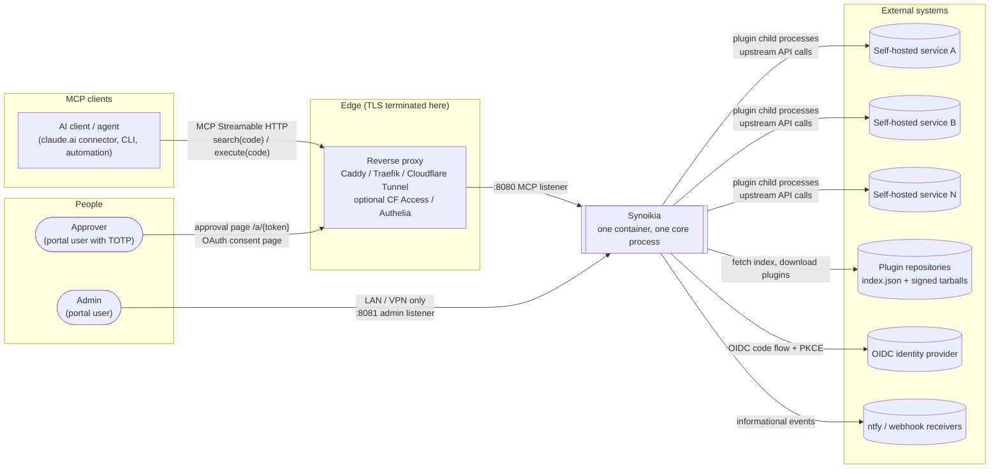
```mermaid
flowchart LR
  subgraph People
    admin(["Admin<br/>(portal user)"])
    approver(["Approver<br/>(portal user with TOTP)"])
  end

  subgraph Clients["MCP clients"]
    ai["AI client / agent<br/>(claude.ai connector, CLI, automation)"]
  end

  subgraph Edge["Edge (TLS terminated here)"]
    proxy["Reverse proxy<br/>Caddy / Traefik / Cloudflare Tunnel<br/>optional CF Access / Authelia"]
  end

  syn[["Synoikia<br/>one container, one core process"]]

  subgraph External["External systems"]
    up1[("Self-hosted service A")]
    up2[("Self-hosted service B")]
    up3[("Self-hosted service N")]
    repos[("Plugin repositories<br/>index.json + signed tarballs")]
    idp[("OIDC identity provider")]
    notif[("ntfy / webhook receivers")]
  end

  ai -- "MCP Streamable HTTP<br/>search(code) / execute(code)" --> proxy
  approver -- "approval page /a/{token}<br/>OAuth consent page" --> proxy
  proxy -- ":8080 MCP listener" --> syn
  admin -- "LAN / VPN only<br/>:8081 admin listener" --> syn
  syn -- "plugin child processes<br/>upstream API calls" --> up1 & up2 & up3
  syn -- "fetch index, download plugins" --> repos
  syn -- "OIDC code flow + PKCE" --> idp
  syn -- "informational events" --> notif
```

---

## 2. Deployment and runtime

One image, two listeners, one core process, one child process per enabled instance, one data volume
(§2, §4.4, §11).

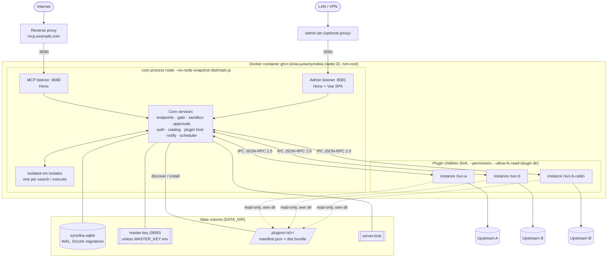
```mermaid
flowchart TB
  internet(["Internet"]) --> rp["Reverse proxy<br/>mcp.example.com"]
  lan(["LAN / VPN"]) --> rpa["admin.lan (optional proxy)"]

  subgraph Container["Docker container  ghcr.io/via-justa/synoikia  (node:22, non-root)"]
    direction TB
    subgraph Core["core process  node --no-node-snapshot dist/main.js"]
      direction TB
      mcpL["MCP listener :8080<br/>Hono"]
      admL["Admin listener :8081<br/>Hono + Vue SPA"]
      svc["Core services<br/>endpoints · gate · sandbox · approvals<br/>auth · catalog · plugin host · notify · scheduler"]
      iso["isolated-vm isolates<br/>one per search / execute"]
      mcpL --> svc
      admL --> svc
      svc <--> iso
    end

    subgraph Children["Plugin children  (fork, --permission, --allow-fs-read=plugin dir)"]
      c1["instance /svc-a"]
      c2["instance /svc-b"]
      c3["instance /svc-b-cabin"]
    end

    svc <-- "IPC JSON-RPC 2.0" --> c1 & c2 & c3
  end

  subgraph Volume["/data volume (DATA_DIR)"]
    db[("synoikia.sqlite<br/>WAL, Drizzle migrations")]
    mk[["master.key (0600)<br/>unless MASTER_KEY env"]]
    plg[/"plugins/&lt;id&gt;/<br/>manifest.json + dist bundle"/]
    lock[["server.lock"]]
  end

  rp -- ":8080" --> mcpL
  rpa -- ":8081" --> admL
  svc --- db & mk & lock
  svc -- "discover / install" --- plg
  c1 & c2 & c3 -. "read-only, own dir" .-> plg
  c1 --> u1[("Upstream A")]
  c2 --> u2[("Upstream B")]
  c3 --> u3[("Upstream B'")]
```

---

## 3. Repository and packages

The pnpm monorepo, what each package depends on, and what gets published (CLAUDE.md, §11, §4.5).

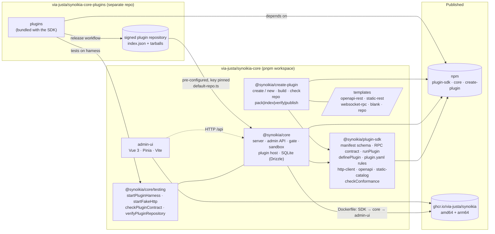
```mermaid
flowchart LR
  subgraph Mono["via-justa/synoikia-core (pnpm workspace)"]
    sdk["@synoikia/plugin-sdk<br/>manifest schema · RPC contract · runPlugin<br/>definePlugin · plugin.yaml rules<br/>http-client · openapi · static-catalog<br/>checkConformance"]
    core["@synoikia/core<br/>server · admin API · gate · sandbox<br/>plugin host · SQLite (Drizzle)"]
    testing["@synoikia/core/testing<br/>startPluginHarness · startFakeHttp<br/>checkPluginContract · verifyPluginRepository"]
    ui["admin-ui<br/>Vue 3 · Pinia · Vite"]
    cp["@synoikia/create-plugin<br/>create / new · build · check<br/>repo pack|index|verify|publish"]
    tpl[/"templates<br/>openapi-rest · static-rest<br/>websocket-rpc · blank · repo"/]
  end

  core --> sdk
  testing --- core
  cp --> sdk
  cp --- tpl
  ui -. "HTTP /api" .-> core

  subgraph Outputs["Published"]
    npm[("npm<br/>plugin-sdk · core · create-plugin")]
    ghcr[("ghcr.io/via-justa/synoikia<br/>amd64 + arm64")]
  end

  sdk --> npm
  core --> npm
  cp --> npm
  core -- "Dockerfile: SDK → core → admin-ui" --> ghcr
  ui --> ghcr

  subgraph Plugins["via-justa/synoikia-core-plugins (separate repo)"]
    pl["plugins<br/>(bundled with the SDK)"]
    rel[("signed plugin repository<br/>index.json + tarballs")]
  end

  pl -- "depends on" --> npm
  pl -- "tests on harness" --> testing
  pl -- "release workflow" --> rel
  rel -- "pre-configured, key pinned<br/>default-repo.ts" --> core
```

---

## 4. Core components

Modules under `packages/core/src` and how they depend on each other. `app.ts` wires one instance of
each service into the shared `AppContext`.

```mermaid
flowchart TB
  subgraph HTTP["http/"]
    mcpapp["mcp-app.ts<br/>Host/Origin check"]
    endpoint["mcp/endpoint.ts<br/>McpServer per instance<br/>sessions, tool annotations"]
    oauthR["mcp/oauth-routes.ts<br/>OAuth 2.1 AS + metadata"]
    apprR["mcp/approval-routes.ts<br/>/a/{token} page"]
    pages["mcp/pages.ts<br/>login / consent HTML"]
    admapp["admin-app.ts<br/>CSRF guard, SPA static"]
    admAuth["admin/auth.ts"]
    admInst["admin/instances.ts"]
    admSys["admin/system.ts"]
  end

  subgraph Auth["auth/"]
    mcpAuth["mcp-auth.ts<br/>external · bearer · oauth"]
    tokens["mcp-tokens.ts"]
    oauth["oauth.ts"]
    users["users.ts (argon2id)"]
    totp["totp.ts"]
    oidc["oidc.ts"]
    sessions["sessions.ts"]
    throttle["throttle.ts"]
  end

  subgraph Exec["execution"]
    runtime["runtime/<br/>executeCode · searchCode"]
    sandbox["sandbox/<br/>isolated-vm runner"]
    gate["gate/pipeline.ts"]
    access["gate/access.ts<br/>effectiveAccess()"]
    gateMisc["gate/ match · preapproval<br/>attestation · rate-limit<br/>redact · canonical"]
    approvals["approvals/<br/>service · links"]
  end

  subgraph Plug["plugins and instances"]
    instances["instances/manager.ts<br/>connection · settings"]
    supervisor["plugins/supervisor.ts"]
    process["plugins/process.ts<br/>fork + permission model"]
    discovery["plugins/discovery.ts"]
    repos["plugins/repos.ts<br/>minisign · default-repo"]
    catalog["catalog/<br/>sync · groups · registry · rules"]
  end

  subgraph Infra["infrastructure"]
    db[("db/ schema.ts<br/>better-sqlite3 + Drizzle")]
    crypto["crypto/<br/>SecretBox AES-256-GCM · HKDF · rotate"]
    events["events.ts<br/>CoreEvents bus"]
    notify["notify/<br/>ntfy · webhook"]
    audit["audit.ts · audit-query.ts"]
    maint["maintenance.ts<br/>housekeeping"]
    config["config/env.ts · settings.ts"]
    log["log.ts"]
  end

  mcpapp --> endpoint & oauthR & apprR
  oauthR --> pages
  apprR --> pages
  endpoint --> mcpAuth
  endpoint --> runtime
  endpoint --> instances
  mcpAuth --> tokens & oauth
  oauthR --> oauth & users & totp & oidc & sessions
  apprR --> approvals & sessions & totp
  admapp --> admAuth & admInst & admSys
  admAuth --> users & totp & oidc & sessions & throttle
  admInst --> instances & catalog & approvals
  admSys --> repos & tokens & oauth & notify & audit

  runtime --> sandbox
  runtime --> gate
  gate --> access & gateMisc & approvals
  gate --> supervisor
  gate --> audit

  instances --> supervisor --> process
  instances --> catalog
  repos --> discovery
  catalog --> supervisor

  approvals --> db
  audit --> db
  catalog --> db
  instances --> crypto
  users --> crypto
  notify --> crypto
  events --> notify
  supervisor -. "status, crashes" .-> events
  catalog -. "sync results" .-> events
  maint --> db
```

---

## 5. Listeners and routes

A route that belongs to one listener does not exist on the other (§2.1, §8.4).

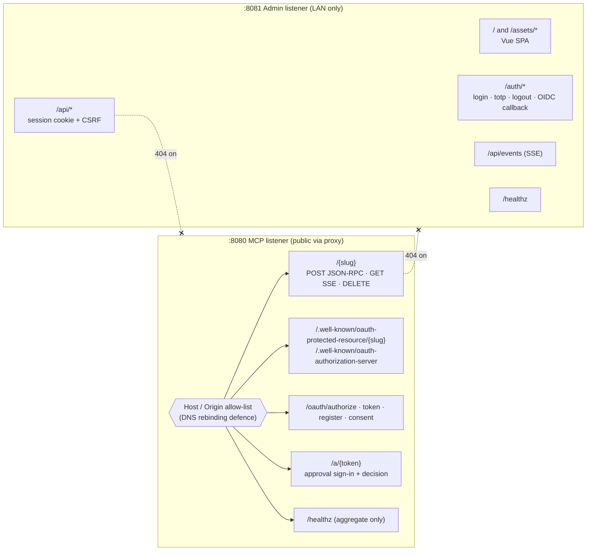
```mermaid
flowchart LR
  subgraph MCP[":8080 MCP listener (public via proxy)"]
    direction TB
    hostchk{{"Host / Origin allow-list<br/>(DNS rebinding defence)"}}
    slug["/{slug}<br/>POST JSON-RPC · GET SSE · DELETE"]
    wk["/.well-known/oauth-protected-resource/{slug}<br/>/.well-known/oauth-authorization-server"]
    oa["/oauth/authorize · token · register · consent"]
    ap["/a/{token}<br/>approval sign-in + decision"]
    h1["/healthz (aggregate only)"]
    hostchk --> slug & wk & oa & ap & h1
  end

  subgraph ADM[":8081 Admin listener (LAN only)"]
    direction TB
    spa["/ and /assets/*<br/>Vue SPA"]
    api["/api/*<br/>session cookie + CSRF"]
    au["/auth/*<br/>login · totp · logout · OIDC callback"]
    sse["/api/events (SSE)"]
    h2["/healthz"]
  end

  slug -. "404 on" .-x ADM
  api -. "404 on" .-x MCP
```

---

## 6. Plugin model

### 6.1 Responsibilities

Anything that decides whether a call may reach the upstream lives in core. A plugin can only supply
inputs to the gate (§3.1).

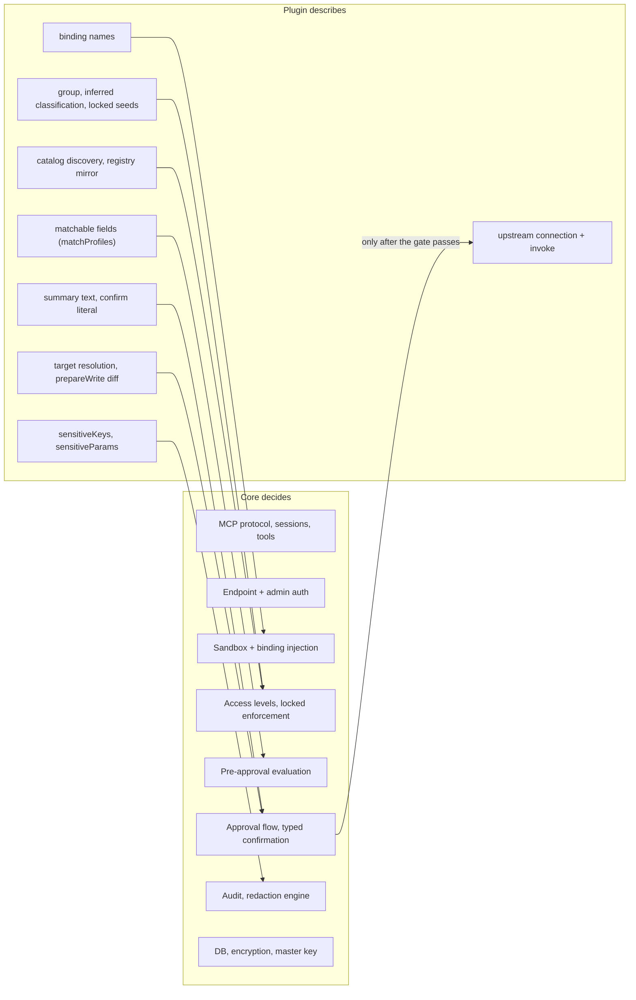
```mermaid
flowchart LR
  subgraph CoreSide["Core decides"]
    direction TB
    a1["MCP protocol, sessions, tools"]
    a2["Endpoint + admin auth"]
    a3["Sandbox + binding injection"]
    a4["Access levels, locked enforcement"]
    a5["Pre-approval evaluation"]
    a6["Approval flow, typed confirmation"]
    a7["Audit, redaction engine"]
    a8["DB, encryption, master key"]
  end

  subgraph PluginSide["Plugin describes"]
    direction TB
    b1["binding names"]
    b2["group, inferred classification, locked seeds"]
    b3["matchable fields (matchProfiles)"]
    b4["summary text, confirm literal"]
    b5["sensitiveKeys, sensitiveParams"]
    b6["catalog discovery, registry mirror"]
    b7["target resolution, prepareWrite diff"]
    b8["upstream connection + invoke"]
  end

  b1 --> a3
  b2 --> a4
  b3 --> a5
  b4 --> a6
  b5 --> a7
  b6 --> a4
  b7 --> a6
  a6 -- "only after the gate passes" --> b8
```

### 6.2 Anatomy of a plugin

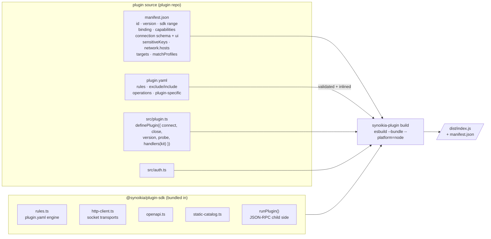
```mermaid
flowchart LR
  subgraph Src["plugin source (plugin repo)"]
    man["manifest.json<br/>id · version · sdk range<br/>binding · capabilities<br/>connection schema + ui<br/>sensitiveKeys · network.hosts<br/>targets · matchProfiles"]
    yaml["plugin.yaml<br/>rules · exclude/include<br/>operations · plugin-specific"]
    code["src/plugin.ts<br/>definePlugin({ connect, close,<br/>version, probe, handlers(kit) })"]
    authf["src/auth.ts"]
  end

  subgraph SDK["@synoikia/plugin-sdk (bundled in)"]
    rules["rules.ts<br/>plugin.yaml engine"]
    http["http-client.ts<br/>socket transports"]
    oapi["openapi.ts"]
    stat["static-catalog.ts"]
    run["runPlugin()<br/>JSON-RPC child side"]
  end

  build["synoikia-plugin build<br/>esbuild --bundle --platform=node"]
  out[/"dist/index.js<br/>+ manifest.json"/]

  man --> build
  yaml -- "validated + inlined" --> build
  code --> build
  authf --> build
  SDK --> build
  build --> out
```

### 6.3 Core ⇄ plugin RPC contract

Transport is the `child_process.fork` IPC channel carrying JSON-RPC 2.0 (§3.3).

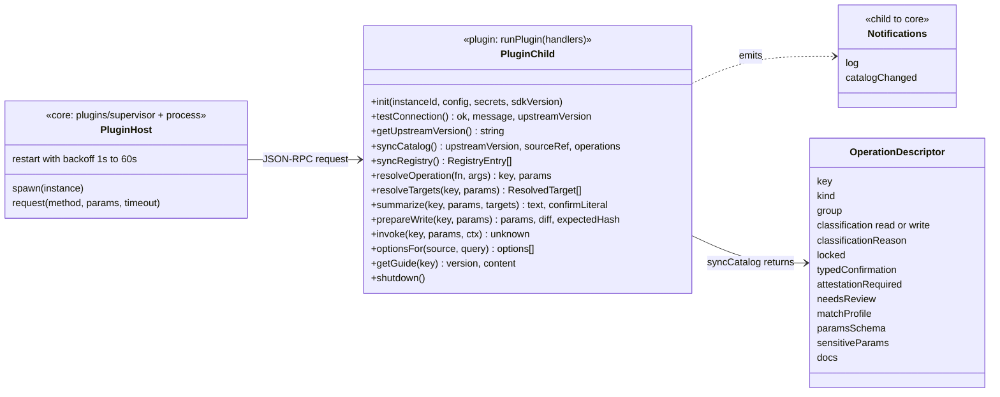
```mermaid
classDiagram
  direction LR
  class PluginHost {
    <<core: plugins/supervisor + process>>
    spawn(instance)
    request(method, params, timeout)
    restart with backoff 1s to 60s
  }
  class PluginChild {
    <<plugin: runPlugin(handlers)>>
    +init(instanceId, config, secrets, sdkVersion)
    +testConnection() ok, message, upstreamVersion
    +getUpstreamVersion() string
    +syncCatalog() upstreamVersion, sourceRef, operations
    +syncRegistry() RegistryEntry[]
    +resolveOperation(fn, args) key, params
    +resolveTargets(key, params) ResolvedTarget[]
    +summarize(key, params, targets) text, confirmLiteral
    +prepareWrite(key, params) params, diff, expectedHash
    +invoke(key, params, ctx) unknown
    +optionsFor(source, query) options[]
    +getGuide(key) version, content
    +shutdown()
  }
  class Notifications {
    <<child to core>>
    log
    catalogChanged
  }
  class OperationDescriptor {
    key
    kind
    group
    classification read or write
    classificationReason
    locked
    typedConfirmation
    attestationRequired
    needsReview
    matchProfile
    paramsSchema
    sensitiveParams
    docs
  }
  PluginHost --> PluginChild : JSON-RPC request
  PluginChild ..> Notifications : emits
  PluginChild --> OperationDescriptor : syncCatalog returns
```

---

## 7. `search(code)`

Read-only discovery. Served entirely from the database; the plugin is never called (§5.1).

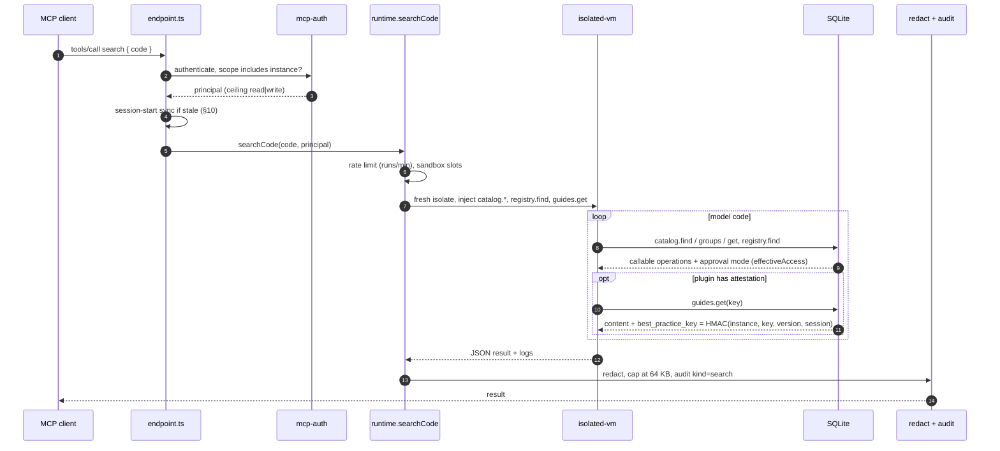
```mermaid
sequenceDiagram
  autonumber
  participant C as MCP client
  participant E as endpoint.ts
  participant A as mcp-auth
  participant R as runtime.searchCode
  participant S as isolated-vm
  participant DB as SQLite
  participant X as redact + audit

  C->>E: tools/call search { code }
  E->>A: authenticate, scope includes instance?
  A-->>E: principal (ceiling read|write)
  E->>E: session-start sync if stale (§10)
  E->>R: searchCode(code, principal)
  R->>R: rate limit (runs/min), sandbox slots
  R->>S: fresh isolate, inject catalog.*, registry.find, guides.get
  loop model code
    S->>DB: catalog.find / groups / get, registry.find
    DB-->>S: callable operations + approval mode (effectiveAccess)
    opt plugin has attestation
      S->>DB: guides.get(key)
      DB-->>S: content + best_practice_key = HMAC(instance, key, version, session)
    end
  end
  S-->>R: JSON result + logs
  R->>X: redact, cap at 64 KB, audit kind=search
  X-->>C: result
```

---

## 8. `execute(code)` and the permission gate

Every binding call inside the sandbox goes through this pipeline. Every branch is audited (§5.2).

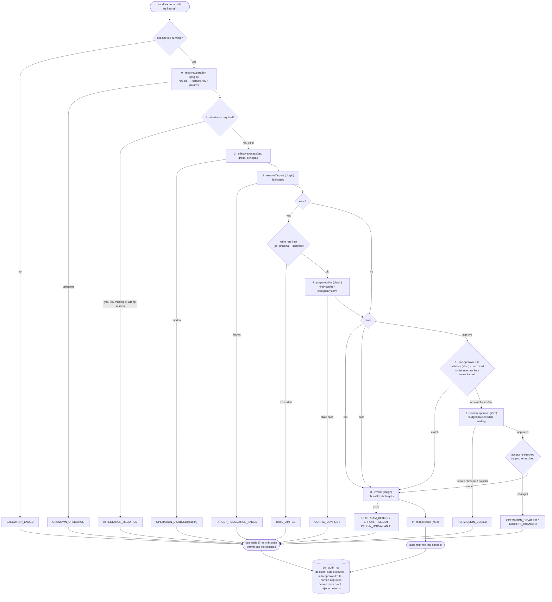
```mermaid
flowchart TD
  start(["sandbox code calls ns.fn(args)"]) --> ended{"execute still running?"}
  ended -- no --> eEnded["EXECUTION_ENDED"]
  ended -- yes --> s0["0 · resolveOperation (plugin)<br/>raw call → catalog key + params"]
  s0 -- unknown --> eUnk["UNKNOWN_OPERATION"]
  s0 --> s1{"1 · attestation required?"}
  s1 -- "yes, key missing or wrong session" --> eAtt["ATTESTATION_REQUIRED"]
  s1 -- "no / valid" --> s2["2 · effectiveAccess(op, group, principal)"]
  s2 -- hidden --> eDis["OPERATION_DISABLED{reason}"]
  s2 --> s3["3 · resolveTargets (plugin)<br/>fail closed"]
  s3 -- throws --> eTgt["TARGET_RESOLUTION_FAILED"]
  s3 --> wl{"write?"}
  wl -- yes --> rl{"write rate limit<br/>(per principal + instance)"}
  rl -- exceeded --> eRL["RATE_LIMITED"]
  rl -- ok --> s4
  wl -- no --> mode
  s4["4 · prepareWrite (plugin)<br/>kind=config + configTransform"] -- stale hash --> eCfg["CONFIG_CONFLICT"]
  s4 --> mode{"mode"}

  mode -- run --> inv
  mode -- auto --> inv
  mode -- approve --> s6{"6 · pre-approval rule<br/>matches (strict) · unexpired<br/>under rule rate limit<br/>never locked"}
  s6 -- "match" --> inv
  s6 -- "no match / limit hit" --> s7["7 · human approval (§5.3)<br/>budget paused while waiting"]
  s7 -- "denied / timeout / no path" --> eDen["PERMISSION_DENIED"]
  s7 -- approved --> rechk{"access re-checked<br/>targets re-resolved"}
  rechk -- "changed" --> eChg["OPERATION_DISABLED / TARGETS_CHANGED"]
  rechk -- same --> inv

  inv["8 · invoke (plugin)<br/>ctx.callId, ctx.targets"] -- error --> eUp["UPSTREAM_DENIED / ERROR / TIMEOUT<br/>PLUGIN_UNAVAILABLE"]
  inv --> s9["9 · redact result (§5.5)"]
  s9 --> ok(["value returned into sandbox"])

  eEnded & eUnk & eAtt & eDis & eTgt & eRL & eCfg & eDen & eChg & eUp --> thrown(["catchable Error with .code<br/>thrown into the sandbox"])
  ok & thrown --> aud[("10 · audit_log<br/>decision: auto-executed · auto-approved:rule · human-approved<br/>denied · timed-out · rejected:reason")]
```

### 8.1 End to end

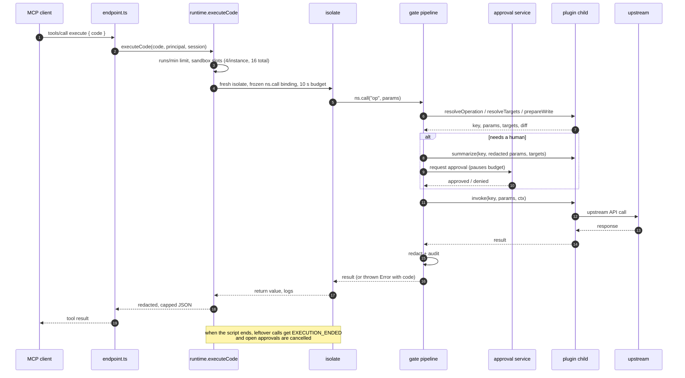
```mermaid
sequenceDiagram
  autonumber
  participant C as MCP client
  participant E as endpoint.ts
  participant RT as runtime.executeCode
  participant SB as isolate
  participant G as gate pipeline
  participant AP as approval service
  participant P as plugin child
  participant U as upstream

  C->>E: tools/call execute { code }
  E->>RT: executeCode(code, principal, session)
  RT->>RT: runs/min limit, sandbox slots (4/instance, 16 total)
  RT->>SB: fresh isolate, frozen ns.call binding, 10 s budget
  SB->>G: ns.call("op", params)
  G->>P: resolveOperation / resolveTargets / prepareWrite
  P-->>G: key, params, targets, diff
  alt needs a human
    G->>P: summarize(key, redacted params, targets)
    G->>AP: request approval (pauses budget)
    AP-->>G: approved / denied
  end
  G->>P: invoke(key, params, ctx)
  P->>U: upstream API call
  U-->>P: response
  P-->>G: result
  G->>G: redact + audit
  G-->>SB: result (or thrown Error with code)
  SB-->>RT: return value, logs
  RT-->>E: redacted, capped JSON
  E-->>C: tool result
  Note over RT,SB: when the script ends, leftover calls get EXECUTION_ENDED<br/>and open approvals are cancelled
```

---

## 9. Access levels

`effectiveAccess()` in `gate/access.ts` is the one function the gate, `search` and the portal use
(§5.2.1).

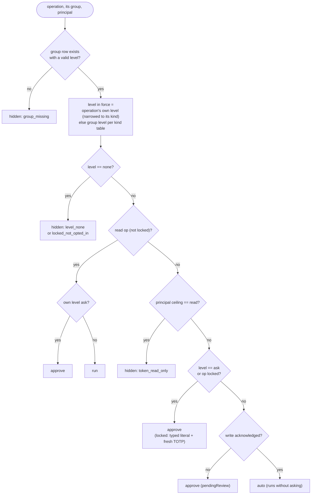
```mermaid
flowchart TD
  in(["operation, its group, principal"]) --> g{"group row exists<br/>with a valid level?"}
  g -- no --> h0["hidden: group_missing"]
  g -- yes --> lvl["level in force =<br/>operation's own level (narrowed to its kind)<br/>else group level per kind table"]
  lvl --> n{"level == none?"}
  n -- yes --> h1["hidden: level_none<br/>or locked_not_opted_in"]
  n -- no --> rd{"read op (not locked)?"}
  rd -- yes --> rdask{"own level ask?"}
  rdask -- yes --> ap1["approve"]
  rdask -- no --> run["run"]
  rd -- no --> ceil{"principal ceiling == read?"}
  ceil -- yes --> h2["hidden: token_read_only"]
  ceil -- no --> askq{"level == ask<br/>or op locked?"}
  askq -- yes --> ap2["approve<br/>(locked: typed literal + fresh TOTP)"]
  askq -- no --> ack{"write acknowledged?"}
  ack -- no --> ap3["approve (pendingReview)"]
  ack -- yes --> auto["auto (runs without asking)"]
```

| Group level | Read | Write                              | Locked                  |
| ----------- | ---- | ---------------------------------- | ----------------------- |
| `none`      | off  | off                                | off                     |
| `read`      | run  | off                                | off                     |
| `ask`       | run  | asks (pre-approval rules may pass) | only with its own `ask` |
| `write`     | run  | runs once acknowledged             | only with its own `ask` |

---

## 10. Human approval

An approval comes from a person on Synoikia's own page, never from the client that made the call
(§5.3).

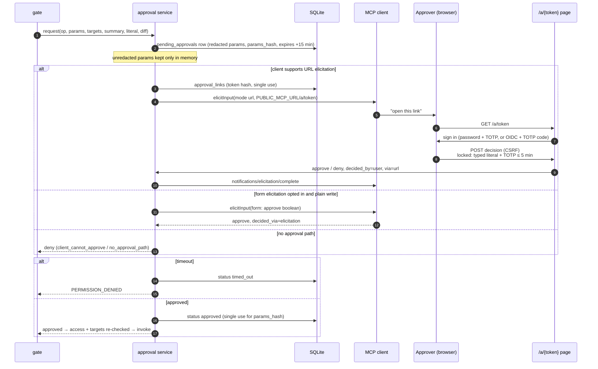
```mermaid
sequenceDiagram
  autonumber
  participant G as gate
  participant AP as approval service
  participant DB as SQLite
  participant C as MCP client
  participant H as Approver (browser)
  participant PG as /a/{token} page

  G->>AP: request(op, params, targets, summary, literal, diff)
  AP->>DB: pending_approvals row (redacted params, params_hash, expires +15 min)
  Note over AP: unredacted params kept only in memory
  alt client supports URL elicitation
    AP->>DB: approval_links (token hash, single use)
    AP->>C: elicitInput(mode url, PUBLIC_MCP_URL/a/token)
    C->>H: "open this link"
    H->>PG: GET /a/token
    PG->>H: sign in (password + TOTP, or OIDC + TOTP code)
    H->>PG: POST decision (CSRF)<br/>locked: typed literal + TOTP ≤ 5 min
    PG->>AP: approve / deny, decided_by=user, via=url
    AP->>C: notifications/elicitation/complete
  else form elicitation opted in and plain write
    AP->>C: elicitInput(form: approve boolean)
    C-->>AP: approve, decided_via=elicitation
  else no approval path
    AP-->>G: deny (client_cannot_approve / no_approval_path)
  end
  alt timeout
    AP->>DB: status timed_out
    AP-->>G: PERMISSION_DENIED
  else approved
    AP->>DB: status approved (single use for params_hash)
    AP-->>G: approved → access + targets re-checked → invoke
  end
```

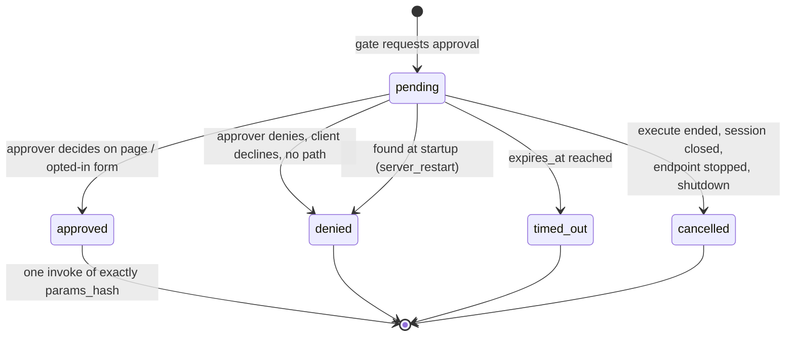
```mermaid
stateDiagram-v2
  [*] --> pending: gate requests approval
  pending --> approved: approver decides on page / opted-in form
  pending --> denied: approver denies, client declines, no path
  pending --> timed_out: expires_at reached
  pending --> cancelled: execute ended, session closed,<br/>endpoint stopped, shutdown
  pending --> denied: found at startup (server_restart)
  approved --> [*]: one invoke of exactly params_hash
  denied --> [*]
  timed_out --> [*]
  cancelled --> [*]
```

---

## 11. MCP endpoint authentication

Global default mode with a per-instance override; scope and audience are checked on every request
(§6.2).

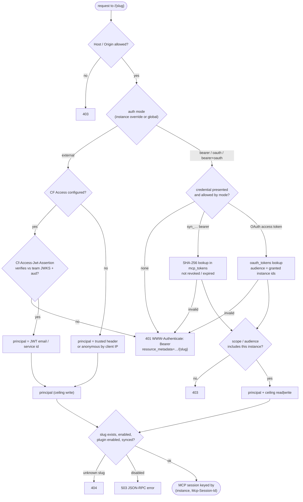
```mermaid
flowchart TD
  req(["request to /{slug}"]) --> host{"Host / Origin allowed?"}
  host -- no --> r403a["403"]
  host -- yes --> mode{"auth mode<br/>(instance override or global)"}

  mode -- external --> cf{"CF Access configured?"}
  cf -- yes --> jwt{"Cf-Access-Jwt-Assertion<br/>verifies vs team JWKS + aud?"}
  jwt -- no --> r401
  jwt -- yes --> idx["principal = JWT email / service id"]
  cf -- no --> hdr["principal = trusted header<br/>or anonymous by client IP"]

  mode -- "bearer / oauth / bearer+oauth" --> cred{"credential presented<br/>and allowed by mode?"}
  cred -- none --> r401["401 WWW-Authenticate: Bearer<br/>resource_metadata=…/{slug}"]
  cred -- "syn_… bearer" --> bt["SHA-256 lookup in mcp_tokens<br/>not revoked / expired"]
  cred -- "OAuth access token" --> ot["oauth_tokens lookup<br/>audience = granted instance ids"]
  bt -- invalid --> r401
  ot -- invalid --> r401

  bt & ot --> scope{"scope / audience<br/>includes this instance?"}
  scope -- no --> r403["403"]
  scope -- yes --> pr["principal + ceiling read|write"]
  idx & hdr --> pr2["principal (ceiling write)"]
  pr & pr2 --> ex{"slug exists, enabled,<br/>plugin enabled, synced?"}
  ex -- "unknown slug" --> r404["404"]
  ex -- disabled --> r503["503 JSON-RPC error"]
  ex -- ok --> serve(["MCP session keyed by<br/>(instance, Mcp-Session-Id)"])
```

### 11.1 OAuth 2.1 (built-in authorization server)

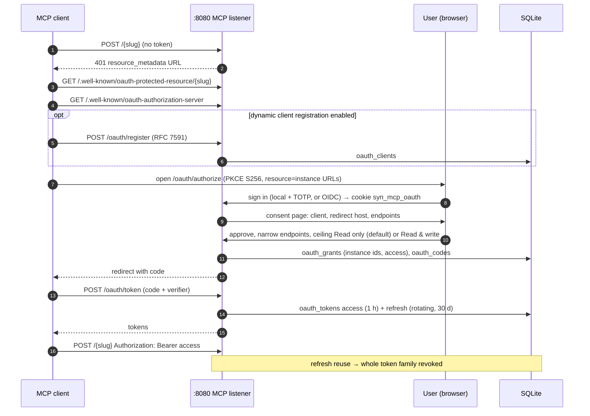
```mermaid
sequenceDiagram
  autonumber
  participant C as MCP client
  participant M as :8080 MCP listener
  participant U as User (browser)
  participant DB as SQLite

  C->>M: POST /{slug} (no token)
  M-->>C: 401 resource_metadata URL
  C->>M: GET /.well-known/oauth-protected-resource/{slug}
  C->>M: GET /.well-known/oauth-authorization-server
  opt dynamic client registration enabled
    C->>M: POST /oauth/register (RFC 7591)
    M->>DB: oauth_clients
  end
  C->>U: open /oauth/authorize (PKCE S256, resource=instance URLs)
  U->>M: sign in (local + TOTP, or OIDC) → cookie syn_mcp_oauth
  M->>U: consent page: client, redirect host, endpoints
  U->>M: approve, narrow endpoints, ceiling Read only (default) or Read & write
  M->>DB: oauth_grants (instance ids, access), oauth_codes
  M-->>C: redirect with code
  C->>M: POST /oauth/token (code + verifier)
  M->>DB: oauth_tokens access (1 h) + refresh (rotating, 30 d)
  M-->>C: tokens
  C->>M: POST /{slug} Authorization: Bearer access
  Note over M,DB: refresh reuse → whole token family revoked
```

---

## 12. Admin portal authentication

Local users (argon2id), optional TOTP and OIDC, server-side sessions, CSRF (§6.1).

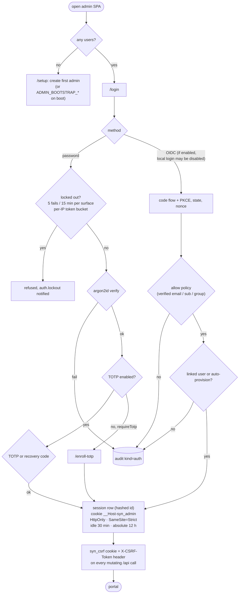
```mermaid
flowchart TD
  open(["open admin SPA"]) --> users{"any users?"}
  users -- no --> setup["/setup: create first admin<br/>(or ADMIN_BOOTSTRAP_* on boot)"]
  users -- yes --> login["/login"]
  login --> how{"method"}
  how -- "password" --> lockchk{"locked out?<br/>5 fails / 15 min per surface<br/>per-IP token bucket"}
  lockchk -- yes --> lo["refused, auth.lockout notified"]
  lockchk -- no --> pw{"argon2id verify"}
  pw -- fail --> audit1[("audit kind=auth")]
  pw -- ok --> totpq{"TOTP enabled?"}
  totpq -- yes --> totp{"TOTP or recovery code"}
  totpq -- "no, requireTotp" --> enroll["/enroll-totp"]
  how -- "OIDC (if enabled,<br/>local login may be disabled)" --> oidc["code flow + PKCE, state, nonce"]
  oidc --> pol{"allow policy<br/>(verified email / sub / group)"}
  pol -- no --> audit1
  pol -- yes --> link{"linked user or auto-provision?"}
  link -- no --> audit1
  totp -- ok --> sess
  link -- yes --> sess
  enroll --> sess
  sess["session row (hashed id)<br/>cookie __Host-syn_admin<br/>HttpOnly · SameSite=Strict<br/>idle 30 min · absolute 12 h"] --> csrf["syn_csrf cookie + X-CSRF-Token header<br/>on every mutating /api call"]
  csrf --> app(["portal"])
```

---

## 13. Plugin install and trust

HACS-style repositories, optional signing with a pinned key, no automatic updates (§4.1–§4.3).

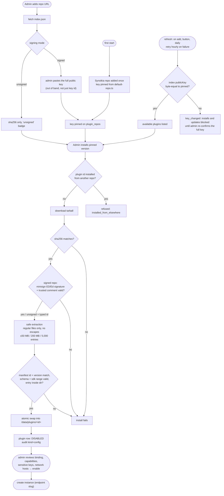
```mermaid
flowchart TD
  addRepo(["Admin adds repo URL"]) --> fetch["fetch index.json"]
  fetch --> mode{"signing mode"}
  mode -- signed --> paste["admin pastes the full public key<br/>(out of band, not just key id)"]
  paste --> pin["key pinned on plugin_repos"]
  mode -- unsigned --> unsig["sha256 only, 'unsigned' badge"]
  def(["first start"]) --> preset["Synoikia repo added once<br/>key pinned from default-repo.ts"] --> pin

  refresh(["refresh: on add, button, daily<br/>retry hourly on failure"]) --> kchk{"index publicKey<br/>byte-equal to pinned?"}
  kchk -- no --> kc["key_changed: installs and updates blocked<br/>until admin re-confirms the full key"]
  kchk -- yes --> avail["available plugins listed"]

  avail --> inst(["Admin installs pinned version"])
  pin --> inst
  unsig --> inst
  inst --> conflict{"plugin id installed<br/>from another repo?"}
  conflict -- yes --> refuse["refused: installed_from_elsewhere"]
  conflict -- no --> dl["download tarball"]
  dl --> sha{"sha256 matches?"}
  sha -- no --> fail["install fails"]
  sha -- yes --> sig{"signed repo:<br/>minisign ED/Ed signature<br/>+ trusted comment valid?"}
  sig -- no --> fail
  sig -- "yes / unsigned + typed id" --> ext["safe extraction<br/>regular files only, no escapes<br/>≤50 MB / 200 MB / 5,000 entries"]
  ext --> mf{"manifest id + version match,<br/>schema + sdk range valid,<br/>entry inside dir?"}
  mf -- no --> fail
  mf -- yes --> swap["atomic swap into /data/plugins/&lt;id&gt;"]
  swap --> disabled["plugin row: DISABLED<br/>audit kind=config"]
  disabled --> review(["admin reviews binding, capabilities,<br/>sensitive keys, network hosts → enable"])
  review --> newInst(["create instance (endpoint slug)"])
```

---

## 14. Instance lifecycle and supervision

Each enabled instance runs in its own permission-confined child (§4.4, §10).

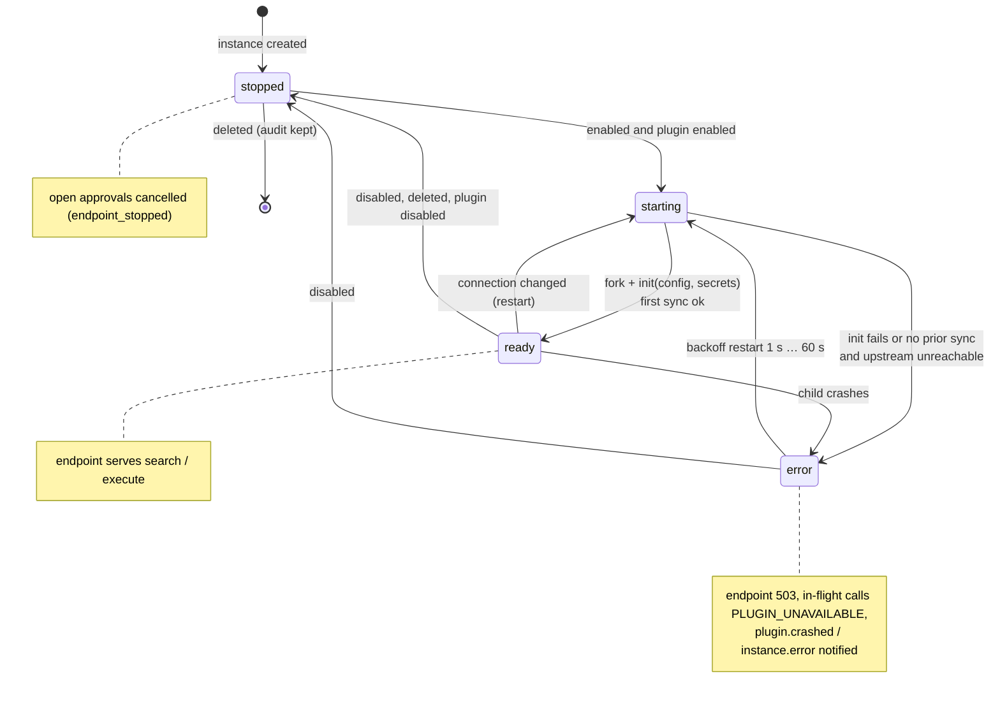
```mermaid
stateDiagram-v2
  [*] --> stopped: instance created
  stopped --> starting: enabled and plugin enabled
  starting --> ready: fork + init(config, secrets)<br/>first sync ok
  starting --> error: init fails or no prior sync<br/>and upstream unreachable
  ready --> error: child crashes
  error --> starting: backoff restart 1 s … 60 s
  ready --> starting: connection changed (restart)
  ready --> stopped: disabled, deleted, plugin disabled
  error --> stopped: disabled
  stopped --> [*]: deleted (audit kept)

  note right of ready
    endpoint serves search / execute
  end note
  note right of error
    endpoint 503, in-flight calls PLUGIN_UNAVAILABLE,
    plugin.crashed / instance.error notified
  end note
  note right of stopped
    open approvals cancelled (endpoint_stopped)
  end note
```

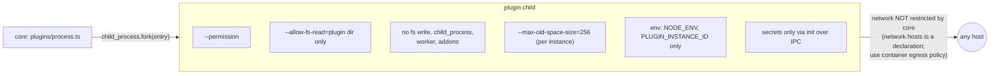
```mermaid
flowchart LR
  core["core: plugins/process.ts"] -- "child_process.fork(entry)" --> child
  subgraph child["plugin child"]
    direction TB
    f1["--permission"]
    f2["--allow-fs-read=plugin dir only"]
    f3["no fs write, child_process,<br/>worker, addons"]
    f4["--max-old-space-size=256 (per instance)"]
    f5["env: NODE_ENV, PLUGIN_INSTANCE_ID only"]
    f6["secrets only via init over IPC"]
  end
  child -- "network NOT restricted by core<br/>(network.hosts is a declaration;<br/>use container egress policy)" --> net(("any host"))
```

---

## 15. Catalog sync and maintenance

The scheduler keeps each instance's catalog current; a per-instance mutex shares concurrent syncs
(§10, §5.2.1).

```mermaid
flowchart TD
  t1(["new MCP session"]) --> stale{"last_synced_at > syncMaxAge (1 h)<br/>or upstream version changed?"}
  stale -- yes --> sync
  stale -- no --> serve(["serve session"])
  t2(["every 30 min, open sessions"]) --> ver{"getUpstreamVersion ≠ stored?"} -- yes --> sync
  t3(["daily backstop (staggered)"]) --> sync
  t4(["Sync now / POST …/sync"]) --> sync
  t5(["plugin catalogChanged"]) -- debounced --> sync

  sync["per-instance mutex<br/>syncCatalog (+ syncRegistry)"] --> ok{"success?"}
  ok -- no --> keep["keep last catalog, last_sync_status=error<br/>notify sync.failed<br/>(no prior sync → instance error, 503)"]
  ok -- yes --> diff["diff into operations"]
  diff --> d1["map plugin_group through aliases<br/>new groups start at ask"]
  diff --> d2["missing rows → stale"]
  diff --> d3["new ops in existing group get own level<br/>reads: read · writes: none"]
  diff --> d4["read→write or changed descriptor<br/>resets write acknowledgement"]
  diff --> d5["newly locked → own level cleared,<br/>its rules disabled"]
  diff --> d6["rules re-checked against match profiles<br/>misfits disabled"]
  diff --> d7["registry_entries, guides"]
  d3 & d4 & d6 --> pr["notify sync.pending_review"]
  d1 & d2 & d3 & d4 & d5 & d6 & d7 --> serve

  hk(["hourly housekeeping"]) --> h1["purge pre_approval_hits, expired sessions,<br/>OAuth codes/tokens, approval links,<br/>decided approvals > 7 days"]
  hk --> h2["optional audit.retentionDays"]
  ri(["daily"]) --> h3["plugin repo index refresh<br/>(never installs)"]
```

---

## 16. Data model

One SQLite file, instance-scoped tables, Drizzle migrations applied on startup (§7). Columns are
abridged; `🔒` marks AES-256-GCM encrypted columns.

```mermaid
erDiagram
  users ||--o{ sessions : has
  users ||--o{ oauth_grants : consents
  users ||--o{ pre_approval_rules : creates
  plugin_repos ||--o{ plugins : provides
  plugins ||--o{ plugin_instances : "runs as"
  plugin_instances ||--o{ operation_groups : has
  plugin_instances ||--o{ operation_group_aliases : regroups
  plugin_instances ||--o{ operations : catalogs
  plugin_instances ||--o{ registry_entries : mirrors
  plugin_instances ||--o{ pending_approvals : awaits
  plugin_instances ||--o{ audit_log : records
  operation_groups ||--o{ operations : groups
  operations ||--o{ guides : documents
  operations ||--o{ pre_approval_rules : "covered by"
  operations ||--o{ pending_approvals : for
  pre_approval_rules ||--o{ pre_approval_hits : counts
  pending_approvals ||--o| approval_links : "opened via"
  oauth_clients ||--o{ oauth_grants : receives
  oauth_grants ||--o{ oauth_codes : issues
  oauth_grants ||--o{ oauth_tokens : issues

  users {
    int id PK
    text username UK
    text password_hash "argon2id"
    blob totp_secret_enc "🔒"
    text recovery_codes_hash
    text oidc_issuer
    text oidc_subject
    bool disabled
  }
  sessions {
    text id_hash PK
    int user_id FK
    text kind "admin | oauth_ui | approval_ui"
    datetime expires_at
  }
  settings {
    text key PK
    text value "JSON"
  }
  oidc_config {
    int id PK
    text issuer
    blob client_secret_enc "🔒"
    text allow_policy
    bool auto_provision
  }
  plugin_repos {
    int id PK
    text url UK
    text signing_mode "signed | unsigned"
    text public_key
    text key_status "ok | key_changed"
    text index_cache
  }
  plugins {
    int id PK
    text plugin_id UK
    text version
    int repo_id FK
    text sha256
    bool signature_verified
    text manifest
    text status "ok | invalid | incompatible"
    bool enabled
  }
  plugin_instances {
    int id PK
    int plugin_id FK
    text slug UK
    text config
    blob secrets_enc "🔒"
    text auth_mode "NULL = inherit"
    text settings
    text status "stopped | starting | ready | error"
    text upstream_version
    datetime last_synced_at
  }
  operation_groups {
    int id PK
    int instance_id FK
    text key
    text level "none | read | ask | write"
    bool stale
  }
  operation_group_aliases {
    int instance_id FK
    text plugin_group
    text group_key
  }
  operations {
    int id PK
    int instance_id FK
    text key
    text classification "read | write"
    bool locked
    text level_override "NULL follows group"
    bool write_acknowledged
    bool typed_confirmation
    bool attestation_required
    text match_profile
    text params_schema
    text sensitive_params
    bool stale
  }
  registry_entries {
    int id PK
    int instance_id FK
    text kind
    text ext_id
    text scopes
    text attrs
  }
  guides {
    int id PK
    int operation_id FK
    text version
    text content
  }
  pre_approval_rules {
    int id PK
    int operation_id FK
    text match "JSON conditions"
    int rate_limit
    int window_seconds
    datetime expires_at
    text reason
    bool enabled
  }
  pre_approval_hits {
    int id PK
    int rule_id FK
    datetime occurred_at
  }
  pending_approvals {
    int id PK
    int operation_id FK
    text params_display "redacted"
    text params_hash
    text summary
    text confirm_literal
    text diff
    text status
    text decided_by
    text decided_via "elicitation | url"
  }
  approval_links {
    text token_hash PK
    int approval_id FK
    datetime expires_at
    datetime used_at
  }
  audit_log {
    int id PK
    datetime at
    text kind "call | search | config | auth | plugin"
    int instance_id
    text operation_key
    text decision
    text actor_kind "mcp_client | user | system"
    text params "redacted"
    text detail
  }
  mcp_tokens {
    int id PK
    text name
    text token_hash UK
    text scope "instance ids or *"
    text access "read | write"
    datetime expires_at
  }
  oauth_clients {
    int id PK
    text client_id UK
    text redirect_uris
    text registered_via "dcr | admin"
  }
  oauth_grants {
    int id PK
    int client_id FK
    int user_id FK
    text resources "instance ids"
    text access "read | write"
  }
  oauth_codes {
    text code_hash PK
    int grant_id FK
    text code_challenge
  }
  oauth_tokens {
    text token_hash PK
    int grant_id FK
    text kind "access | refresh"
    text family_id
  }
  notifier_channels {
    int id PK
    text kind "ntfy | webhook"
    blob secrets_enc "🔒"
    text events
    text instance_filter
  }
```

### 16.1 Who writes what

```mermaid
flowchart LR
  api["Admin API<br/>(signed-in user)"] --> t1["users · settings · oidc_config<br/>plugin_repos · plugins · plugin_instances<br/>group levels/labels · aliases<br/>operation levels/acks · rules<br/>mcp_tokens · oauth_clients · notifiers"]
  sync["Sync jobs<br/>(from plugin output)"] --> t2["operations · operation_groups<br/>registry_entries · guides<br/>rules.enabled (off) · instance sync cols"]
  gate["Gate / approval service"] --> t3["pending_approvals<br/>pre_approval_hits · audit_log"]
  as["OAuth AS"] --> t4["oauth_* · sessions(oauth_ui)"]
  none["Nobody"] -. "never update/delete" .-> t5["audit_log (append-only)"]
  sbx["Sandboxed code<br/>plugin children"] -. "no path" .-x t1
```

---

## 17. Secrets and redaction

### 17.1 Master key and encryption

```mermaid
flowchart TD
  env["MASTER_KEY env (base64, 32 B)"] --> mk
  file["DATA_DIR/master.key (0600)<br/>created on first boot, with warning"] --> mk
  mk(["master key"]) --> box["SecretBox<br/>AES-256-GCM, random 96-bit nonce<br/>blob = v1 ‖ nonce ‖ ct ‖ tag<br/>AAD = table:column:row-id"]
  mk -- HKDF --> k1["attestation HMAC key"]
  mk -- HKDF --> k2["signed-state key<br/>(MFA, consent forms)"]
  mk -- HKDF --> k3["session-id pepper"]

  box --> c1["plugin_instances.secrets_enc"]
  box --> c2["users.totp_secret_enc"]
  box --> c3["oidc_config.client_secret_enc"]
  box --> c4["notifier_channels.secrets_enc"]

  c1 -- "decrypted for that instance only" --> init["plugin init() over IPC"]
  apiGet["Admin API GET"] -. "{ set: true, hint: …ab12 }<br/>never plaintext" .-> c1
  rot["cli.js rotate-master-key<br/>(server stopped, server.lock)"] -- "decrypt all, re-encrypt in one txn,<br/>clear sessions" --> box
```

### 17.2 Redaction

```mermaid
flowchart LR
  subgraph Rules["what is redacted"]
    g["global key list<br/>password, token, apiKey, secret, …"]
    pk["plugin sensitiveKeys"]
    ik["instance extra keys"]
    sp["operation sensitiveParams<br/>(JSON pointers)"]
    sv["instance's actual secret values<br/>(+ URL/JSON-escaped forms)"]
  end

  eng(["core redaction engine<br/>case/_/- insensitive<br/>short rules match last word only"])
  g & pk & ik & sp & sv --> eng

  eng --> o1["sandbox output: result, console.log,<br/>error messages"]
  eng --> o2["registry.find attrs at source"]
  eng --> o3["summarize() input"]
  eng --> o4["pending approvals + diffs"]
  eng --> o5["audit_log"]
  eng --> o6["admin portal + approval page"]
  eng --> o7["notification bodies"]
  invoke["plugin invoke()"] -. "receives the real values" .-> real[("unredacted params<br/>held in memory only")]
  sr["plugin sensitiveResult<br/>(masked inside the plugin by<br/>rules.maskResult, before core)"] --> o1
```

---

## 18. Notifications and events

Informational only; notifications never carry approve/deny links (§9).

```mermaid
flowchart LR
  subgraph Sources
    sup["supervisor<br/>crash / status"]
    syn["catalog sync"]
    th["login throttle"]
  end

  bus(("CoreEvents bus"))
  sup & syn & th --> bus

  bus --> ev1["instance.error / instance.recovered<br/>plugin.crashed"]
  bus --> ev2["sync.failed / sync.pending_review"]
  bus --> ev3["auth.lockout"]
  bus --> sse["/api/events SSE<br/>(admin portal live status)"]
  bus --> canc["instance stopped →<br/>cancel open approvals"]

  ev1 & ev2 & ev3 --> ns["NotifierService<br/>per-channel event + instance filter<br/>redacted summaries only"]
  ns --> ntfy["ntfy<br/>JSON publish"]
  ns --> wh["webhook<br/>X-Synoikia-Signature = HMAC-SHA256(ts.body)"]
  ns -. "3 attempts, backoff,<br/>no retry on 4xx except 429" .-> ns
```

---

## 19. Admin portal

Vue 3 SPA served by the admin listener. Plugins never ship JavaScript to it: plugin UI is JSON
Schema rendered by a fixed widget library (§8).

```mermaid
flowchart TB
  subgraph SPA["admin-ui (Vue 3 + Pinia + vue-router)"]
    direction TB
    pub["public: /login · /setup"]
    en["/enroll-totp"]
    subgraph Main["AppLayout (sidebar)"]
      ov["Overview"]
      au["Audit Log"]
      pl["Plugins<br/>Installed · Available · Repositories"]
      cl["Clients &amp; Tokens"]
      ne["New endpoint"]
      subgraph Inst["/endpoints/:slug"]
        con["Connection"]
        acc["Access"]
        rul["Pre-Approval Rules"]
        ist["Endpoint Settings"]
      end
      subgraph Set["/settings"]
        sm["MCP access"]
        ss["Admin UI security"]
        su["Users"]
        sn["Notifications"]
        sp["Profile"]
      end
    end
    stores["Pinia stores<br/>session · app"]
    comps["widgets<br/>SchemaForm · RegistryPicker · ChipsInput<br/>TotpEnrollment · ConnectClient · ModalDialog"]
  end

  api["api.ts<br/>fetch + X-CSRF-Token"]
  Main --> stores --> api
  con & rul --> comps
  api -- "/api/* · /auth/*" --> core[":8081 Admin API"]
  core -- "/api/events SSE" --> stores
  core -- "manifest connection schema<br/>matchProfiles · optionsFor" --> comps
```

---

## 20. Plugin development and release

Plugins live outside this repo and prove themselves against the real core (§4.5).

```mermaid
flowchart LR
  scaffold["pnpm create @synoikia/plugin<br/>(repo templates: base, release, claude)"] --> new["synoikia-plugin new<br/>archetype: openapi-rest · static-rest<br/>websocket-rpc · blank"]
  new --> write["write manifest.json, plugin.yaml,<br/>src/plugin.ts (definePlugin)"]
  write --> build["synoikia-plugin build<br/>→ dist/index.js"]
  build --> check["synoikia-plugin check<br/>manifests, plugin.yaml, versions"]
  check --> unit["unit tests<br/>checkConformance()"]
  unit --> e2e["e2e tests<br/>startPluginHarness + startFakeHttp<br/>checkPluginContract"]
  e2e --> pack["repo pack → index → sign (minisign)"]
  pack --> verify["repo verify<br/>verifyPluginRepository():<br/>install every plugin as core would,<br/>start each as a confined child"]
  verify --> publish["repo publish<br/>GitHub release assets + index.json"]
  publish --> installs(["Synoikia installs fetch it (§13)"])

  subgraph Harness["@synoikia/core/testing harness"]
    hz["copies release files to temp DATA_DIR/plugins<br/>boots real core, in-memory DB<br/>enables plugin, creates + syncs instance<br/>execute / search / setGroupLevel / addRule / audit"]
  end
  e2e --- Harness
```

---

## 21. Trust boundaries

Where each control sits (§12).

```mermaid
flowchart LR
  inet(["Internet"]) -- "B1: auth mode, scoped tokens/grants,<br/>403 outside scope, read ceiling by default" --> mcp
  lan(["LAN admin"]) -- "B2: separate port, login + TOTP/OIDC,<br/>sessions, CSRF, lockout" --> adm

  subgraph CoreProc["core process (trusted)"]
    mcp["MCP listener"]
    adm["Admin listener"]
    gate["permission gate<br/>+ approvals + audit"]
    dbk[("SQLite + master key")]
    mcp --> sbx
    sbx["isolated-vm sandbox<br/>B3: only the binding is reachable,<br/>no DB, no Node APIs"] -- "binding call" --> gate
    adm --> dbk
    gate --> dbk
  end

  approver(["Approver + TOTP"]) -- "B4: approval page only,<br/>never the calling client" --> gate
  gate -- "B5: invoke only after the gate passes" --> child
  child["plugin child<br/>permission model, scrubbed env,<br/>own secrets only"] --> up(["upstream"])
  repo(["plugin repository"]) -- "B6: pinned version, sha256,<br/>pinned-key signature, prebuilt only,<br/>arrives disabled" --> child
  child -. "residual risk: unrestricted network egress,<br/>can mislabel its own classifications" .-> inet
```

---

## 22. Startup and shutdown

```mermaid
sequenceDiagram
  autonumber
  participant M as main.ts
  participant A as createAppContext
  participant DB as SQLite
  participant P as plugin host
  participant L as listeners

  M->>A: config from env
  A->>A: load / create master key, SecretBox
  A->>DB: open (WAL), run migrations
  A->>DB: deny orphaned pending approvals (server_restart)
  A->>DB: bootstrap admin from ADMIN_BOOTSTRAP_* if no users
  A->>DB: normalize stored settings JSON
  A->>P: discover /data/plugins, validate manifests
  A->>A: add default signed repo once
  A->>P: start enabled instances (fork, init, sync)
  A->>A: timers: hourly housekeeping + staggered daily sync / repo refresh
  M->>L: MCP :8080 and Admin :8081
  Note over M,L: SIGTERM / SIGINT
  M->>A: drain(): stop timers, cancel open approvals,<br/>close MCP sessions + SSE streams
  M->>L: close listeners (5 s grace, then cut)
  M->>A: stop(): shut down plugin children, close DB
```
